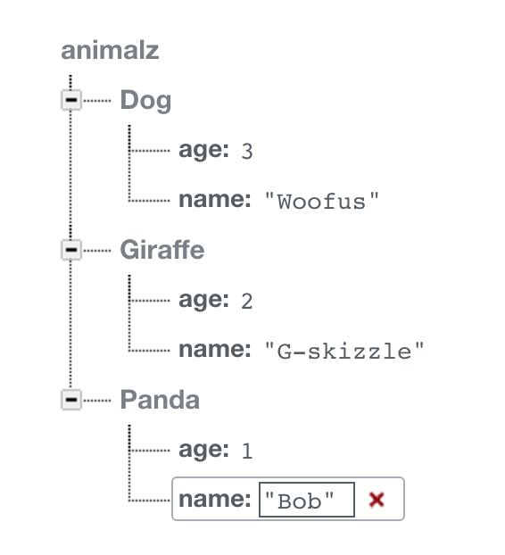

# FirebaseSample
This is a simple tutorial on how to use Firebase with a simple web application (reading and writing data). Firebase can also be used for other types of applications, such as iOS and Android apps.

----
## What is Firebase
[Firebase](https://www.firebase.com/) is essentially a platform to easily setup a backend of an application. This means setting up how you want to organize data for your application, like users for example. Firebase can store data, do user authentication, and even static hosting for any websites you might want to host.

## Getting Started
[Create an account](https://www.firebase.com/account/#/). Once that's done, we can create an app to register with Firebase on our dashboard (give it an app name and url). Now under the main 'animalz' object, create data using the '+' button. Here you will see you can give a 'name' and 'value', as well as create more of a hierarchy. Create a dog animal under the 'animalz' object, with a 'name' property and an 'age' property. Your tree should look like this:

We're going to setup a simple website that allows you to display a dog's name and age depending on the button clicked. It's very simple, but this is a tutorial on using Firebase! We will also allow users to set ages of animals via a textbox. See the index.html file to see how to connect with and use the Firebase API. Specifically, we need to include the script like such in the head:

     

## Connection to Firebase
Using Firebase starts with a single instantiation of a Firebase object that connects with the app you created on the Firebase dashboard under your account. For our 'Animalz' app, it looks like:

     var connection = new Firebase('https://animalz.firebaseio.com/');

The url passed in is found on the dashboard, and is the url name you provided upon creating the app on Firebase. Now we can interact with this object to read and write data, as this is the direct link to your 'cloud' backend for the app.

## Reading Data
Reading data is like reading a tree. We start with the base object 'connection', and grab the child of that object. In the child object we pass in the path we want. For us, we want the dog, so our code will look like this.

    connection.child("dog").on("value", function(snapshot) {
    alert(snapshot.child('name').val() + ": " +  snapshot.child('age').val());});

Here we grab the child of the dog and want what Firebase calls a 'snapshot'. Here we can parse the data like JSON, and grab the value of the name and age of the dog.

## Writing Data
Writing data we have to specify a point in the tree where to begin writing data and we simply set data like JSON format. It looks like so:

    connection.set({
      dog: {
        name: "Bob",
        age: dogAge++
      }
    });

## What Now
Now, what we have is a very simplistic static webpage, that can interact with Firebase services and displaying/writing data. Obviously nothing super useful, but you see how easy it is to get started, and how powerful this service can be, especially if you're under a time crunch and don't want to deal with setting up a backend from scratch. Have fun using Firebase!
